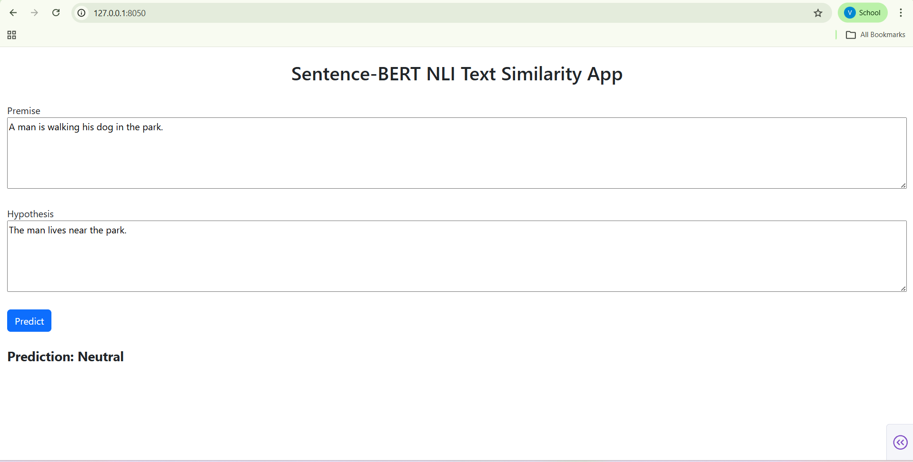

# 📘 Sentence-BERT Based Natural Language Inference (NLI) System

## 📌 Project Overview

This project implements a **Sentence-BERT (SBERT) based Natural Language Inference (NLI) model** to classify the semantic relationship between a *premise* and a *hypothesis* into one of three categories:

* **Entailment**
* **Neutral**
* **Contradiction**

The model is trained and evaluated using the **SNLI (Stanford Natural Language Inference)** and **MNLI (Multi-Genre Natural Language Inference)** datasets.

The final trained model is deployed as an interactive **web application using Dash**, allowing users to test sentence pairs in real time.

---


# 📂 Repository Structure

```
├── app/
│   ├── app.py                # Dash web application
│   ├── bert_update.py        # SBERT encoder implementation
│   ├── sbert_encoder.pth     # Trained encoder weights
│   ├── sbert_classifier.pth  # Trained classifier head
│   ├── sbert_config.json     # Model configuration
│   └── word2id.pkl           # Vocabulary
│
├── images/
│   └── web_page.png        # Web app screenshots
│
├── Task 1/
│   └── Code for Task 1
│
├── Task 2/
│   └── Code for Task 2 & Task 3 (including classification report generation)
│
├── Documentation.pdf         # Full project documentation
└── README.md

---

# 🔧 Tasks Breakdown

## ✅ Task 1

* Data preprocessing
* Tokenization
* Vocabulary construction
* Baseline model implementation

## ✅ Task 2

* Transformer-based encoder implementation
* SBERT architecture design
* Training on SNLI/MNLI
* Classification report generation

## ✅ Task 3

* Performance evaluation
* Analysis of results
* Model improvements

## ✅ Web Application

* Real-time NLI prediction interface
* Implemented using Dash
* Deployable locally

---

# 🌐 Web Application

The web interface allows users to:

* Enter a **Premise**
* Enter a **Hypothesis**
* Click **Predict**
* View the predicted NLI label

---

## ▶️ How to Run the Web App

1. Open terminal
2. Navigate into the `app` folder:

```
cd app
```

3. Run:

```
python app.py
```

4. Open browser and go to:

```
http://127.0.0.1:8050/
```




# 📄 Documentation

The full project documentation is available in:

```
Documentation.pdf
```

It includes:

* Dataset details
* Training process
* Hyperparameters
* Model architecture explanation
* Performance metrics (SNLI & MNLI)
* Classification reports
* Challenges and improvements

---


